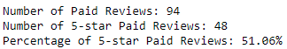
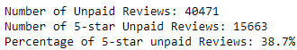
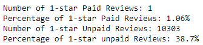

# Amazon_Vine_Analysis

## Overview

Analyzing Amazon reviews written by members of the paid Amazon Vine program. The Amazon Vine program is a service that allows manufacturers and publishers to receive reviews for their products. Companies like SellBy pay a small fee to Amazon and provide products to Amazon Vine members, who are then required to publish a review.

Pick one of these datasets and use PySpark to perform the ETL process to extract the dataset, transform the data, connect to an AWS RDS instance, and load the transformed data into pgAdmin. Then use Pandas to determine if there is any bias toward favorable reviews from Vine members in your dataset. Then, you’ll write a summary of the analysis for Jennifer to submit to the SellBy stakeholders.

## Results

Paid:

Unpaid:

## Summary

There seems to be a positivity bias in the vine program as the paid program reviews are getting 12.36% more 5-star reviews than the regular reviews. We could do similar checks of the one star reviews as well as that should show the opposite side. Otherwise we could just be confirming there's more 5 stars and maybe the paid program just has more extreme opinions. However, when checking that it only seems to support the positivity bias even more:

